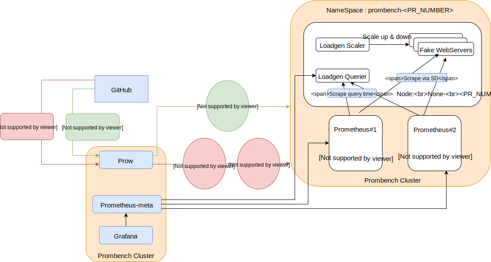

# Automated E2E testing and benchmarking tool for Prometheus.


### The overall components and intercation is shown in this diagram:



It runs with [Prow CI](https://github.com/kubernetes/test-infra/blob/master/prow/) on a [GKE - Google Kubernetes Engine](https://cloud.google.com/kubernetes-engine/) k8s cluster and it is designed in a way to support adding more k8s providers.

Long term plans are to use the [prombench cli tool](cmd/prombench) to deploy and manage everything, but at the moment the  k8s golang client doesn't support `CustomResourceDefinition` objects so for those it uses `kubectl`.

## Prerequisites 
- Create a new Google cloud project - `prometheus-ci`
- Create a [Service Account](https://cloud.google.com/kubernetes-engine/docs/tutorials/authenticating-to-cloud-platform#step_3_create_service_account_credentials) on GKE with role `Kubernetes Engine Service Agent & Kubernetes Engine Admin` and download the json file.
- [Create a GCS bucket](https://console.cloud.google.com/storage/) `prow` in the same project which will be used for [pod-utilities](https://github.com/kubernetes/test-infra/blob/master/prow/pod-utilities.md)

- Set some env variable which will be used in different commands.
```
export PROJECT_ID=prometheus-ci 
export CLUSTER_NAME=prow
export ZONE=us-east1-b
export GCLOUD_SERVICEACCOUNT_CLIENTID=<client_id from the service-account.json>
export AUTH_FILE=<path to service-account.json>
export GCS_BUCKET=prow
export GITHUB_ORG=prometheus
export GITHUB_REPO=prometheus
export GRAFANA_ADMIN_PASSWORD=$(openssl rand -hex 20)
export HMAC_TOKEN=$(openssl rand -hex 20)
```
## Setup Prow CI

- Create the main k8s cluster to deploy the Prow components.

```
./prombench gke cluster create -a $AUTH_FILE -v PROJECT_ID:$PROJECT_ID \
-v ZONE:$ZONE -v CLUSTER_NAME:$CLUSTER_NAME -f components/prow/cluster.yaml
```

## Initialize kubectl with cluster login credentials
```
gcloud container clusters get-credentials $CLUSTER_NAME --zone=$ZONE
```
## Add an auth token that will be used to authenticate when sending requests to the github api.
For this we will generate a [new auth token](https://github.com/settings/tokens) from the [Prombot account](https://github.com/prombot) which has access to all repos in the Prometheus org.

```
kubectl create secret generic oauth-token --from-literal=oauth=***genratedToken***
```

## Setup the github webhooks.
1. add the url as a github webhook
```
http://prombench.prometheus.io/hook
```
- Webhok Options: 
  * Content Type: json
  * Send Everything
  * Secret: `echo $HMAC_TOKEN`

the ip DNS record will be added once we get it from the ingress deployment in the following steps.

2. Add the $HMAC_TOKEN as a secret in the prow cluster as this will be used to authenticate the webhook
```
kubectl create secret generic hmac-token --from-literal=hmac=$HMAC_TOKEN
```

## Add the service-account json file as a kubernetes secret
```
kubectl create secret generic service-account --from-file=$AUTH_FILE
```

## Deploy all internal prow components and the [nginx-ingress-controller](https://github.com/kubernetes/ingress-nginx) which will be used to access all public components.
```
./prombench gke resource apply -a $AUTH_FILE -v ZONE:$ZONE -v CLUSTER_NAME:$CLUSTER_NAME \
-v GCLOUD_SERVICEACCOUNT_CLIENTID:$GCLOUD_SERVICEACCOUNT_CLIENTID \
-f components/prow/manifests/rbac.yaml -f components/prow/manifests/nginx-controller.yaml

export INGRESS_IP=$(kubectl get ingress ing -o go-template='{{ range .status.loadBalancer.ingress}}{{.ip}}{{ end }}')

kubectl apply -f components/prow/manifests/prow_internals_1.yaml

./prombench gke resource apply -a $AUTH_FILE -v PROJECT_ID:$PROJECT_ID \
-v ZONE:$ZONE -v CLUSTER_NAME:$CLUSTER_NAME -v INGRESS_IP:$INGRESS_IP \
-v GITHUB_ORG:$GITHUB_ORG -v GITHUB_REPO:$GITHUB_REPO \
-v GCS_BUCKET:$GCS_BUCKET -f components/prow/manifests/prow_internals_2.yaml
```

## Deploy grafana & prometheus-meta.
```
./prombench gke resource apply -a $AUTH_FILE -v PROJECT_ID:$PROJECT_ID \
-v ZONE:$ZONE -v CLUSTER_NAME:$CLUSTER_NAME -v INGRESS_IP:$INGRESS_IP \
-v GRAFANA_ADMIN_PASSWORD:$GRAFANA_ADMIN_PASSWORD -f components/prombench/manifests/results
```

The components will be accessible at the following links:
  * Grafana ::  http://$INGRESS-IP/grafana
  * Prometheus ::  http://$INGRESS-IP/prometheus-meta
  * Prow dashboard :: http://$INGRESS-IP/
  * Prow hook :: http://$INGRESS-IP/hook
